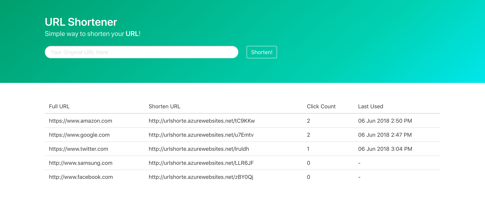
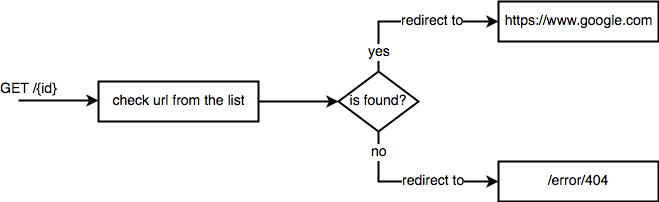

# Overview
URL Shorte able to generate shorten URL base on the given original URL.  
<https://urlshorte.azurewebsites.net>

# Builds
Application hosted on Azure Web App.  

Technology stacks:
- NPM
- Node JS
- HTML5, CSS, Javascript
- MongoDB

# Views
Front end look and feel be like   




# API Endpoints
## GET /list
is used to get the list of shortened url with original url  

Response Body
```json
[
    {
        "_id": "5b1782f15acbad1450e0264d",
        "url": "https://www.amazon.com",
        "shorturl": "http://urlshorte.azurewebsites.net/tC9KKw",
        "code": "tC9KKw",
        "clickcnt": 2,
        "createdate": "2018-06-06T06:45:05.789Z",
        "__v": 0,
        "lastused": "2018-06-06T06:50:03.555Z"
    },
    {
        "_id": "5b17834e5acbad1450e0264e",
        "url": "https://www.google.com",
        "shorturl": "http://urlshorte.azurewebsites.net/u7Emtv",
        "code": "u7Emtv",
        "clickcnt": 2,
        "createdate": "2018-06-06T06:46:38.136Z",
        "__v": 0,
        "lastused": "2018-06-06T06:47:15.560Z"
    }
]
```
| Parameter | Representation | Description |
| --------- | -------------- | ----------- |
| _id       | alphanumeric   | unique identifier |
| url       | alphanumeric   | original url |
| shorturl  | alphanumeric   | shortened url |
| code      | alphanumeric   | shortened url code |
| clickcnt  | numeric        | per click counter |
| createdate | datetime      | utc date & time for short url creation |
| lastused  | datetime       | utc date & time on last redirect request |


## POST /shorten
is used to generate shorten url with original url

Request Body
```json
{
    "url": "https://www.google.com"
}
```
| Parameter | Representation | Description |
| --------- | -------------- | ----------- |
| url       | alphanumeric | original url to be shorten |

Response Body
```json
{
    "url": "https://www.google.com",
    "shorturl": "http://urlshorte.azurewebsites.net/WSYJWy"
}
```
| Parameter | Representation | Description |
| --------- | -------------- | ----------- |
| url       | alphanumeric   | original url |
| shorturl  | alphanumeric   | shorten url that generated |


## GET /{id}
is used to redirect with specific id (shorten id)

Response Redirect flow  


## GET /error/404
is used to display 404 - not found page

Response Body
```json
{
    "message": "short url is invalid"
}
```
| Parameter | Representation | Description |
| --------- | -------------- | ----------- |
| message   | alphanumeric   | response message |
